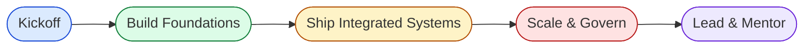
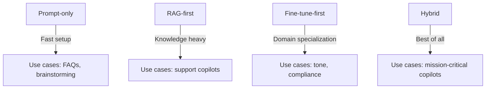

# Path to GenAI Expert

> A paced, portfolio-focused curriculum for engineers who want to master generative AI and lead delivery-ready AI programs.

  

## Table of Contents
- [How to Use This Repo](#how-to-use-this-repo)
- [Learning Path Overview](#learning-path-overview)
- [Phase 0 – Orientation](#phase-0--orientation)
  - [Orientation & Study Plan](#orientation--study-plan)
  - [Module 00 · Introduction](#module-00--introduction)
- [Phase 1 – Foundations](#phase-1--foundations)
  - [Module 01 · GenAI Fundamentals](#module-01--genai-fundamentals)
  - [Math for GenAI](#math-for-genai)
  - [Module 02 · Prompting & Structured Outputs](#module-02--prompting--structured-outputs)
  - [Prompt Engineering Essentials](#prompt-engineering-essentials)
- [Phase 2 – Orchestration & Knowledge Systems](#phase-2--orchestration--knowledge-systems)
  - [Module 03 · Agents & Orchestration](#module-03--agents--orchestration)
  - [Agents & Tool-Use](#agents--tool-use)
  - [Module 04 · RAG Essentials](#module-04--rag-essentials)
  - [Retrieval-Augmented Generation](#retrieval-augmented-generation)
  - [Module 05 · Evaluation & Observability](#module-05--evaluation--observability)
  - [Evaluation & Evals](#evaluation--evals)
- [Phase 3 – Deployment & Optimization](#phase-3--deployment--optimization)
  - [Module 06 · Serving & Inference](#module-06--serving--inference)
  - [Module 07 · Performance & Cost Optimization](#module-07--performance--cost-optimization)
  - [Module 08 · Vector Search](#module-08--vector-search)
  - [LLMOps & MLE for Leaders](#llmops--mle-for-leaders)
- [Phase 4 – Governance, Safety & Storytelling](#phase-4--governance-safety--storytelling)
  - [Module 09 · Security & Safety](#module-09--security--safety)
  - [Security, Privacy & Compliance](#security-privacy--compliance)
  - [Module 10 · Governance & Compliance](#module-10--governance--compliance)
  - [Responsible AI & Governance](#responsible-ai--governance)
  - [Module 11 · Edge & Embedded](#module-11--edge--embedded)
  - [Fine-Tuning & Adapters](#fine-tuning--adapters)
  - [Multimodal](#multimodal)
  - [Module 12 · Portfolio Patterns](#module-12--portfolio-patterns)
  - [Architecture Patterns](#architecture-patterns)
  - [Portfolio & Interview Prep](#portfolio--interview-prep)
  - [Community & Mentoring](#community--mentoring)
- [Hands-On Portfolio Track](#hands-on-portfolio-track)
- [Tooling & Environment Setup](#tooling--environment-setup)
- [Evaluation & Evals Workflow](#evaluation--evals-workflow)
- [Responsible AI & Governance Toolkit](#responsible-ai--governance-toolkit)
- [Project Leadership Playbook](#project-leadership-playbook)
- [Contributing](#contributing)
- [FAQ](#faq)
- [Glossary](#glossary)
- [What’s Next](#whats-next)

## How to Use This Repo
1. **Pick your cadence.** Choose a 4/8/12/24-week plan from the [Learning Path Overview](#learning-path-overview) and block recurring study, build, and retro sessions in your calendar.
2. **Focus each module.** Select one primary resource from the tables below, skim the rest for context, and write down explicit success metrics before you start building.
3. **Ship the mini-task.** Complete the mini-task for the module, capture metrics (quality, latency, cost), and link your work back to the module entry in `/curriculum`.
4. **Reflect and iterate.** After every build, add lessons learned, blockers, and open questions to your experiment log (see `PROJECT_TEMPLATES/EXPERIMENT_LOG.md`).
5. **Share and lead.** Present your progress weekly to a peer or mentor, practice stakeholder-ready demos, and capture risks/mitigations using the project brief template.

## Learning Path Overview
### Milestones
- **Kickoff:** Confirm prerequisites, install tooling, and publish your personal study plan.
- **Foundations:** Demonstrate mastery of prompting, embeddings, and lifecycle fundamentals with at least two evaluated demos.
- **Systems:** Build production-shaped RAG/agent systems with regression tests, telemetry, and cost guardrails.
- **Scale & Govern:** Operationalize deployments, optimizations, security reviews, and documentation for leadership sign-off.
- **Lead & Mentor:** Run discovery-to-launch playbooks, mentor contributors, and maintain a portfolio that highlights impact and governance.

### Timeline Options
| Pace | Weekly Commitment | Modules per Week | Expected Outputs |
|------|-------------------|------------------|------------------|
| 4-week sprint | 20–25 hrs | 3 | Rapid prototypes, aggressive documentation, leadership brief |
| 8-week focus | 10–12 hrs | 1–2 | Balanced builds with evaluation suites and risk logs |
| 12-week steady | 6–8 hrs | 1 | Deep dives with comparison studies and stakeholder decks |
| 24-week mastery | 3–4 hrs | 0.5 | Slow-and-steady builds with advanced governance artifacts |

### Prerequisites
- Comfortable with Python, Git, and working in notebooks or VS Code.
- Basic understanding of cloud services, REST APIs, and command-line tooling.
- Commitment to capture metrics and write short reflections after every build.

### Outcomes
- A calibrated study rhythm with an experiment log, risk register, and KPI dashboard.
- Six to ten portfolio-grade projects covering prompting, RAG, agents, optimization, and governance.
- Leadership-ready artifacts: project briefs, stakeholder updates, demo scripts, and risk mitigation plans.
- Confidence to scope, lead, and ship AI-assisted solutions with responsible AI guardrails.

## Phase 0 – Orientation
### Orientation & Study Plan
Build the habits of an AI lead before touching code. This section helps you pick a timeline, set weekly rituals, and create an experiment log that keeps you accountable to outcomes rather than hours. You will leave with a personal roadmap, tracking template, and review cadence that mirrors professional AI programs.

**Resource stack**

| Resource | Format | Level | Est. Time (hrs) | Why this resource? |
| --- | --- | --- | --- | --- |
| [KAUST Generative AI Training Curriculum](https://github.com/kaust-generative-ai/training-curriculum) | Curriculum | Beginner | 6 | Maps a university-style learning path that you can compress or stretch based on your availability. |
| [GenAI Curriculum Tracker](https://github.com/nckclrk/generative-ai-curriculum) | Workbook | Beginner | 3 | Supplies checklists and habit trackers for maintaining an experiment log and weekly retros. |
| [Microsoft Generative AI for Beginners](https://github.com/microsoft/generative-ai-for-beginners) | Course | Beginner | 20 | Offers a canonical syllabus with module outcomes that align to the phases in this repo. |

**Mini-task:** Draft a 12-week plan covering study time, build slots, and reflection windows; commit it to `curriculum/00-introduction/plan.md` and include your success metrics.

<!-- TODO: Extend later
- Add a printable one-page study planner template.
- Include recommended retrospective questions for weekly reviews.
- Capture sample experiment log entries.
-->

### Module 00 · Introduction
This module grounds you in the repository structure, tooling expectations, and documentation cadence. You will practice setting up local and cloud environments, using dev containers, and logging your first metrics so future modules are frictionless.

**Resource stack**

| Resource | Format | Level | Est. Time (hrs) | Why this resource? |
| --- | --- | --- | --- | --- |
| [fastai fastsetup](https://github.com/fastai/fastsetup) | Setup guide | Beginner | 1 | Walks through dependable Python setup steps on macOS, Linux, and Windows. |
| [Google Colab Tools](https://github.com/googlecolab/colabtools) | Documentation | Beginner | 1 | Explains how to leverage Colab GPUs, manage secrets, and collaborate quickly. |
| [dair-ai Machine Learning YouTube Courses](https://github.com/dair-ai/ML-YouTube-Courses) | Playlist index | Beginner | 8 | Provides curated video lessons you can plug into your early study blocks. |

**Mini-task:** Run the `hello-llm.ipynb` notebook (or create your own) that calls a hosted model, records latency, and saves the output plus metric snapshot to your experiment log.

<!-- TODO: Extend later
- Add screenshots of a configured devcontainer.
- Provide a secrets-management quick reference.
- Collect sample experiment log entries from the community.
-->

## Phase 1 – Foundations
### Module 01 · GenAI Fundamentals
Master the core building blocks—tokenization, embeddings, sampling, and LLM lifecycle—so you can reason about trade-offs like an architect. Completing this module means you can explain why a model behaves the way it does, prototype simple prompts, and measure their performance.

**Resource stack**

| Resource | Format | Level | Est. Time (hrs) | Why this resource? |
| --- | --- | --- | --- | --- |
| [OpenAI Cookbook](https://github.com/openai/openai-cookbook) | Cookbook | Beginner | 6 | Demonstrates embeddings, chat, and moderation workflows with runnable notebooks. |
| [Hugging Face Transformers](https://github.com/huggingface/transformers) | Library docs | Intermediate | 10 | Covers model architectures, tokenizer internals, and inference utilities for custom deployments. |
| [Karpathy LLM101n](https://github.com/karpathy/LLM101n) | Course | Intermediate | 12 | Provides annotated lectures that connect math intuition with working PyTorch code. |

**Mini-task:** Build a notebook that explains an LLM response using log probabilities and token-level analysis; capture insights in your experiment log.

<!-- TODO: Extend later
- Add a comparison worksheet for open vs. proprietary APIs.
- Include prompts for explaining transformer internals to stakeholders.
- Record exemplar metric dashboards for simple Q&A systems.
-->

### Math for GenAI
This refresher keeps your mathematical intuition sharp without drowning you in theory. By focusing on the algebra, probability, and optimization concepts you actively use in prompting, embedding search, and fine-tuning, you can reason about quality metrics and optimization levers like a lead engineer.

**Resource stack**

| Resource | Format | Level | Est. Time (hrs) | Why this resource? |
| --- | --- | --- | --- | --- |
| [nn-zero-to-hero](https://github.com/karpathy/nn-zero-to-hero) | Course | Beginner | 10 | Revives calculus and optimization intuition using code-first lectures. |
| [Numerical Linear Algebra](https://github.com/fastai/numerical-linear-algebra) | Book | Intermediate | 12 | Focuses on matrix decompositions and vector spaces essential for embeddings and attention. |
| [Math for ML](https://github.com/cadizm/math-for-ml) | Notes | Beginner | 5 | Condenses probability and vector math essentials into quick-reference notes. |

**Mini-task:** Create a one-page cheat sheet summarizing cosine similarity, softmax, and cross-entropy; add it to `/curriculum/01-genai-fundamentals/notes.md`.

<!-- TODO: Extend later
- Add practice problems tied to upcoming modules.
- Capture visual aids for explaining optimization steps to non-technical stakeholders.
-->

### Module 02 · Prompting & Structured Outputs
Build prompts that produce reliable, schema-compliant outputs and understand how to evaluate them. This module prepares you to hand off prompts to production teams with confidence and to debug failures quickly.

**Resource stack**

| Resource | Format | Level | Est. Time (hrs) | Why this resource? |
| --- | --- | --- | --- | --- |
| [Prompt Engineering Guide](https://github.com/dair-ai/Prompt-Engineering-Guide) | Guide | Intermediate | 6 | Shares tested prompt blueprints, safety considerations, and evaluation tips. |
| [Awesome Prompt Engineering](https://github.com/promptslab/Awesome-Prompt-Engineering) | Repository | Intermediate | 4 | Aggregates tools and research that improve structured outputs and validation. |
| [Outlines](https://github.com/outlines-dev/outlines) | Library | Intermediate | 3 | Provides deterministic prompting primitives (regex, JSON, CFG) to enforce schema fidelity. |

**Mini-task:** Build a prompt pipeline that extracts structured JSON from support emails, validates the schema with `pydantic`, and logs failure cases.

<!-- TODO: Extend later
- Add a gallery of structured output validation strategies.
- Collect examples of schema drift and remediation steps.
- Include evaluation prompts for hallucination checks.
-->

### Prompt Engineering Essentials
Treat prompting as software engineering—versioned, tested, and safe. This section shows you how to create reproducible prompting workflows, integrate evaluation loops, and reason about safety constraints like an AI lead.

**Resource stack**

| Resource | Format | Level | Est. Time (hrs) | Why this resource? |
| --- | --- | --- | --- | --- |
| [Google Cloud Generative AI Examples](https://github.com/GoogleCloudPlatform/generative-ai) | Examples | Beginner | 5 | Demonstrates role/task/format prompting patterns across enterprise-grade APIs. |
| [Anthropic Cookbook](https://github.com/anthropics/anthropic-cookbook) | Cookbook | Intermediate | 6 | Shows Claude function calling, safety settings, and evaluation harnesses. |
| [Microsoft Promptflow](https://github.com/microsoft/promptflow) | Framework | Intermediate | 5 | Enables reproducible prompt pipelines with versioned data and automated tests. |

**Mini-task:** Configure a promptflow project (or equivalent) that runs regression tests on three prompts and posts results to your experiment log.

<!-- TODO: Extend later
- Add deployment-ready CI pipelines for prompt regression.
- Collect examples of safety testing scripts.
- Document recommended prompt versioning practices.
-->

## Phase 2 – Orchestration & Knowledge Systems
### Module 03 · Agents & Orchestration
Move from single prompts to multi-step workflows. You will design tool schemas, permission models, and traceability so that your agents can operate safely and predictably in production contexts.

**Resource stack**

| Resource | Format | Level | Est. Time (hrs) | Why this resource? |
| --- | --- | --- | --- | --- |
| [LangGraph](https://github.com/langchain-ai/langgraph) | Framework | Intermediate | 5 | Introduces graph-based agent orchestration with built-in guardrails. |
| [Marvin](https://github.com/PrefectHQ/marvin) | Framework | Intermediate | 4 | Demonstrates pragmatic task orchestration with Prefect observability. |
| [Semantic Kernel](https://github.com/microsoft/semantic-kernel) | SDK | Intermediate | 6 | Combines planning, connectors, and memory for enterprise-ready agents. |

**Mini-task:** Build a two-tool agent (web search + summarizer) that logs every tool call, outcome, and cost to LangGraph or Prefect and produces a short stakeholder update.

<!-- TODO: Extend later
- Capture sample RACI charts for agent tool permissions.
- Add reusable guardrail snippets for agent retries.
- Include telemetry dashboards for tracing agent behavior.
-->

### Agents & Tool-Use
Focus on designing deterministic tool contracts, safety guardrails, and human-in-the-loop controls. This section equips you to argue for or against tool integrations and to manage risk like an AI program lead.

**Resource stack**

| Resource | Format | Level | Est. Time (hrs) | Why this resource? |
| --- | --- | --- | --- | --- |
| [AutoGen](https://github.com/microsoft/autogen) | Framework | Advanced | 8 | Explores multi-agent collaboration, human-in-the-loop flows, and tool routing. |
| [Langroid](https://github.com/langroid/langroid) | Framework | Advanced | 6 | Emphasizes deterministic tool contracts and streaming trace analysis. |
| [Tool Calling Guide](https://github.com/ALucek/tool-calling-guide) | Guide | Intermediate | 2 | Summarizes schema design and safety considerations for external tool invocation. |

**Mini-task:** Document a tool registry (YAML or JSON) describing inputs, outputs, rate limits, and safety checks for three tools; review it with a peer.

<!-- TODO: Extend later
- Provide sample SOC2-ready tool documentation.
- Add escalation flows for tool failure scenarios.
-->

### Module 04 · RAG Essentials
Bring proprietary knowledge into your LLM stack. You will learn how to ingest, chunk, embed, and evaluate knowledge bases while capturing the metrics leaders need to green-light deployments.

**Resource stack**

| Resource | Format | Level | Est. Time (hrs) | Why this resource? |
| --- | --- | --- | --- | --- |
| [LlamaIndex](https://github.com/jerryjliu/llama_index) | Framework | Intermediate | 6 | Covers ingestion, retrieval, and evaluation building blocks with modular components. |
| [Pinecone Examples](https://github.com/pinecone-io/examples) | Examples | Intermediate | 4 | Demonstrates hybrid search, metadata filtering, and streaming ingestion. |
| [Haystack](https://github.com/deepset-ai/haystack) | Framework | Intermediate | 6 | Provides production-grade pipelines for retrievers, generators, and evaluators. |

**Mini-task:** Implement a small RAG service over a folder of internal docs; log Recall@k, latency, and cost per query.

<!-- TODO: Extend later
- Add guidance on cold-start knowledge ingestion.
- Share scripts for incremental indexing and cache invalidation.
- Capture templates for RAG service runbooks.
-->

### Retrieval-Augmented Generation
Go beyond baseline RAG with graph-based memory, reranking, and cost-sensitive optimization. This section positions you to lead architectural decisions for large knowledge systems.

**Resource stack**

| Resource | Format | Level | Est. Time (hrs) | Why this resource? |
| --- | --- | --- | --- | --- |
| [GraphRAG](https://github.com/microsoft/graphrag) | Toolkit | Advanced | 6 | Shows how to capture relationships and entity graphs for richer retrieval. |
| [fastRAG](https://github.com/IntelLabs/fastRAG) | Toolkit | Advanced | 5 | Benchmarks latency and quality trade-offs across RAG configurations. |
| [Awesome GraphRAG](https://github.com/DEEP-PolyU/Awesome-GraphRAG) | Curated list | Advanced | 3 | Aggregates research and tooling for graph-enhanced retrieval systems. |

**Mini-task:** Compare baseline and graph-enhanced RAG on one dataset; document cost, latency, and quality deltas in your experiment log.

<!-- TODO: Extend later
- Add templates for presenting RAG trade-off decisions to leadership.
- Collect latency budgeting worksheets for RAG stacks.
-->

### Module 05 · Evaluation & Observability
Make quality measurable and regression-proof. This module ensures you can design golden datasets, run automated checks, and communicate evaluation results to stakeholders.

**Resource stack**

| Resource | Format | Level | Est. Time (hrs) | Why this resource? |
| --- | --- | --- | --- | --- |
| [Ragas](https://github.com/explodinggradients/ragas) | Library | Intermediate | 4 | Implements retrieval and answer quality metrics for RAG pipelines. |
| [promptfoo](https://github.com/promptfoo/promptfoo) | CLI | Intermediate | 3 | Automates prompt regression tests with diff-friendly outputs. |
| [Langfuse](https://github.com/langfuse/langfuse) | Platform | Intermediate | 5 | Provides tracing, analytics, and feedback dashboards. |
| [TruLens](https://github.com/truera/trulens) | Framework | Intermediate | 4 | Adds evaluator suites, guardrails, and audit trails for LLM outputs. |

**Mini-task:** Add an automated evaluation step to one of your projects (RAG or agent) using Ragas or promptfoo, and publish the results to a shared dashboard or README.

<!-- TODO: Extend later
- Add sample evaluation rubrics for stakeholders.
- Provide automation examples for nightly regression suites.
- Collect case studies on evaluation-driven rollbacks.
-->

### Evaluation & Evals
Deepen your evaluation practice with research-grade benchmarks and harnesses. This section prepares you to justify evaluation choices to leadership and compliance teams.

**Resource stack**

| Resource | Format | Level | Est. Time (hrs) | Why this resource? |
| --- | --- | --- | --- | --- |
| [InstructEval](https://github.com/declare-lab/instruct-eval) | Benchmark | Advanced | 4 | Supplies task-specific datasets for instruction tuning and evaluation. |
| [BigCode Evaluation Harness](https://github.com/bigcode-project/bigcode-evaluation-harness) | Benchmark | Advanced | 6 | Standardizes code generation metrics, baselines, and prompts. |
| [HELM](https://github.com/stanford-crfm/helm) | Benchmark | Advanced | 8 | Offers comprehensive evaluation across accuracy, safety, and efficiency dimensions. |

**Mini-task:** Design a lightweight evaluation charter summarizing metrics, datasets, and acceptance thresholds for a project; review it with a peer lead.

<!-- TODO: Extend later
- Publish sample evaluation charters for different project types.
- Capture guidance on using LLM-as-a-judge responsibly.
-->

## Phase 3 – Deployment & Optimization
### Module 06 · Serving & Inference
Operate models reliably under production constraints. You will weigh managed vs. self-hosted deployments, implement batching and streaming, and design service-level objectives for AI endpoints.

**Resource stack**

| Resource | Format | Level | Est. Time (hrs) | Why this resource? |
| --- | --- | --- | --- | --- |
| [vLLM](https://github.com/vllm-project/vllm) | Inference engine | Intermediate | 5 | Covers paged KV cache serving with OpenAI-compatible APIs. |
| [Text Generation Inference](https://github.com/huggingface/text-generation-inference) | Inference server | Intermediate | 5 | Demonstrates scalable serving with token streaming and scaling knobs. |
| [TensorRT-LLM](https://github.com/NVIDIA/TensorRT-LLM) | Toolkit | Advanced | 6 | Provides GPU-optimized pipelines, quantization, and multi-GPU orchestration. |

**Mini-task:** Deploy a small open model using vLLM or TGI, expose an OpenAI-compatible endpoint, and capture latency, throughput, and cost metrics.

<!-- TODO: Extend later
- Add Helm charts or Terraform snippets for automated deployments.
- Document blue/green deployment workflows for model updates.
- Collect service-level objective templates.
-->

### Module 07 · Performance & Cost Optimization
Learn how to tune latency, throughput, and cost without sacrificing quality. This module makes you comfortable with quantization, caching, speculative decoding, and routing strategies.

**Resource stack**

| Resource | Format | Level | Est. Time (hrs) | Why this resource? |
| --- | --- | --- | --- | --- |
| [LLM-AWQ](https://github.com/mit-han-lab/llm-awq) | Library | Advanced | 4 | Explains activation-aware quantization with reproducible benchmarks. |
| [LLM Perf Bench](https://github.com/mlc-ai/llm-perf-bench) | Benchmark | Advanced | 5 | Provides scripts to profile latency, throughput, and memory usage. |
| [lit-gpt](https://github.com/Lightning-AI/litgpt) | Framework | Intermediate | 6 | Combines quantization, LoRA, and optimized serving recipes. |

**Mini-task:** Run a performance benchmark comparing baseline vs. quantized or cached inference; document the deltas and decision criteria in your experiment log.

<!-- TODO: Extend later
- Add capacity planning worksheets.
- Provide templates for cost-per-task dashboards.
-->

### Module 08 · Vector Search
Choose and tune the right vector database for your workload. You will compare FAISS, pgvector, and Milvus across quality, latency, and operational complexity.

**Resource stack**

| Resource | Format | Level | Est. Time (hrs) | Why this resource? |
| --- | --- | --- | --- | --- |
| [FAISS](https://github.com/facebookresearch/faiss) | Library | Intermediate | 6 | Explains exact vs. approximate indices and GPU acceleration. |
| [pgvector](https://github.com/pgvector/pgvector) | Extension | Intermediate | 4 | Shows how to embed vector search directly in PostgreSQL. |
| [Milvus](https://github.com/milvus-io/milvus) | Vector database | Intermediate | 6 | Delivers a distributed vector database with hybrid search and scaling. |

**Mini-task:** Swap the vector store in your RAG project (e.g., FAISS → pgvector) and compare Recall@k and latency over a golden dataset.

<!-- TODO: Extend later
- Capture operational checklists for vector store upgrades.
- Add cost comparisons across managed vs. self-hosted options.
-->

### LLMOps & MLE for Leaders
Structure your operations like a modern AI platform team. You will implement observability, rollout/rollback strategies, governance checklists, and stakeholder communications.

**Resource stack**

| Resource | Format | Level | Est. Time (hrs) | Why this resource? |
| --- | --- | --- | --- | --- |
| [Awesome LLMOps](https://github.com/tensorchord/Awesome-LLMOps) | Curated list | Intermediate | 6 | Maps the LLMOps ecosystem for monitoring, deployment, and governance. |
| [LLM Engineer's Handbook](https://github.com/PacktPublishing/LLM-Engineers-Handbook) | Book code | Intermediate | 10 | Provides templates for project management, deployment, and stakeholder updates. |
| [OpenLLMetry](https://github.com/traceloop/openllmetry) | Toolkit | Advanced | 5 | Shows how to instrument LLM apps with OpenTelemetry standards. |

**Mini-task:** Instrument one of your services with OpenLLMetry (or equivalent), add latency and cost alerts, and draft a rollback checklist.

<!-- TODO: Extend later
- Publish sample incident response runbooks.
- Add ROI calculators for LLM features.
-->

## Phase 4 – Governance, Safety & Storytelling
### Module 09 · Security & Safety
Protect users, data, and systems from LLM-specific threats. You will build guardrails, red-team playbooks, and escalation paths that satisfy security reviews.

**Resource stack**

| Resource | Format | Level | Est. Time (hrs) | Why this resource? |
| --- | --- | --- | --- | --- |
| [OWASP Top 10 for LLM Applications](https://github.com/OWASP/www-project-top-10-for-large-language-model-applications) | Guide | Intermediate | 3 | Lists top attack vectors and mitigation strategies for LLM apps. |
| [NeMo Guardrails](https://github.com/NVIDIA/NeMo-Guardrails) | Framework | Intermediate | 5 | Implements policy-based guardrails for chat, RAG, and tool agents. |
| [Rebuff](https://github.com/protectai/rebuff) | Toolkit | Intermediate | 4 | Detects prompt injection attempts and provides sandboxed tool execution. |

**Mini-task:** Conduct a mini red-team on one of your demos using OWASP guidance; document findings, mitigations, and residual risks.

<!-- TODO: Extend later
- Add a prompt-injection replay library.
- Provide templates for security review summaries.
-->

### Security, Privacy & Compliance
Ensure your systems respect privacy laws and data handling policies. This section equips you with checklists, toolkits, and automated checks that compliance teams expect.

**Resource stack**

| Resource | Format | Level | Est. Time (hrs) | Why this resource? |
| --- | --- | --- | --- | --- |
| [AI Privacy Checklist](https://github.com/JariPesonen/AIPrivacyChecklist) | Checklist | Intermediate | 2 | Provides privacy impact questions to ask before shipping AI features. |
| [AI Privacy Toolkit](https://github.com/IBM/ai-privacy-toolkit) | Toolkit | Advanced | 5 | Offers differential privacy utilities and policy templates. |
| [AI Compliance Auditor](https://github.com/awsdataarchitect/ai-compliance-auditor) | Toolkit | Intermediate | 4 | Demonstrates automated compliance checks for data retention and access controls. |

**Mini-task:** Complete a privacy impact assessment for an existing project using the checklist; log findings and remediation actions in your risk tracker.

<!-- TODO: Extend later
- Add DPIA templates aligned with regional regulations.
- Provide examples of redacted logging strategies.
-->

### Module 10 · Governance & Compliance
Learn the language of policy and governance so you can brief legal, risk, and executive stakeholders. You will create model cards, lineage documentation, and go/no-go criteria.

**Resource stack**

| Resource | Format | Level | Est. Time (hrs) | Why this resource? |
| --- | --- | --- | --- | --- |
| [EU AI Act Notes](https://github.com/daveshap/EU_AI_Act) | Notes | Intermediate | 4 | Summarizes obligations by risk class with digestible tables. |
| [AI Governance Playbook](https://github.com/Neetu-kapoor/Ai-governance-playbook) | Playbook | Intermediate | 3 | Provides governance charters, RACI templates, and stakeholder maps. |
| [AI Governance Risk & Compliance Docs](https://github.com/ahsan-141117/AI-Governance-Risk-Compliance-Documentation) | Templates | Intermediate | 3 | Offers audit-ready checklists and policy samples tailored to AI programs. |

**Mini-task:** Produce a one-page governance brief summarizing purpose, risk class, mitigations, and open questions for one of your demos.

<!-- TODO: Extend later
- Collect example governance briefs from industry case studies.
- Add sign-off checklist templates for launch committees.
-->

### Responsible AI & Governance
Operationalize ethics, fairness, and transparency. Use this section to create cross-functional processes, interpretability reports, and continuous monitoring plans.

**Resource stack**

| Resource | Format | Level | Est. Time (hrs) | Why this resource? |
| --- | --- | --- | --- | --- |
| [Awesome Responsible AI](https://github.com/AthenaCore/AwesomeResponsibleAI) | Curated list | Intermediate | 6 | Aggregates research, tooling, and best practices across responsible AI domains. |
| [Responsible AI Toolbox](https://github.com/microsoft/responsible-ai-toolbox) | Toolkit | Intermediate | 6 | Provides interpretability, fairness, and error analysis dashboards. |
| [Awesome ML Model Governance](https://github.com/visenger/Awesome-ML-Model-Governance) | Curated list | Intermediate | 4 | Offers frameworks for lifecycle governance and audit readiness. |

**Mini-task:** Run a bias or fairness analysis on one project using the Responsible AI Toolbox; summarize key findings and mitigations.

<!-- TODO: Extend later
- Add a model card template for this repository.
- Provide case studies on responsible AI escalations.
-->

### Module 11 · Edge & Embedded
Deploy small language models on constrained hardware. You will learn compression, telemetry, and offline testing strategies for edge deployments.

**Resource stack**

| Resource | Format | Level | Est. Time (hrs) | Why this resource? |
| --- | --- | --- | --- | --- |
| [Edge AI for Beginners](https://github.com/microsoft/edgeai-for-beginners) | Course | Intermediate | 10 | Explains hardware-aware deployment and telemetry collection. |
| [ONNX Runtime GenAI](https://github.com/microsoft/onnxruntime-genai) | Toolkit | Intermediate | 5 | Runs quantized models across CPU, GPU, and mobile. |
| [Phi-3 Mini Samples](https://github.com/Azure-Samples/Phi-3MiniSamples) | Examples | Intermediate | 4 | Demonstrates on-device SLM workflows with telemetry capture. |

**Mini-task:** Deploy a small model (Phi-3 mini or similar) on an edge device or emulator, recording latency, memory, and temperature metrics.

<!-- TODO: Extend later
- Document hardware compatibility matrices.
- Add battery impact measurement guidelines.
-->

### Fine-Tuning & Adapters
Upgrade models with efficient fine-tuning strategies. You will compare PEFT methods, understand data curation, and build evaluation pipelines that justify fine-tune investments.

**Resource stack**

| Resource | Format | Level | Est. Time (hrs) | Why this resource? |
| --- | --- | --- | --- | --- |
| [PEFT](https://github.com/huggingface/peft) | Library | Intermediate | 5 | Implements LoRA, QLoRA, and other adapter techniques. |
| [QLoRA](https://github.com/artidoro/qlora) | Toolkit | Advanced | 6 | Explains low-bit fine-tuning with reproducible scripts. |
| [Open Instruct](https://github.com/allenai/open-instruct) | Dataset & recipes | Advanced | 8 | Provides data pipelines and evaluation baselines for supervised fine-tuning. |

**Mini-task:** Fine-tune (or simulate fine-tuning with PEFT) on a small dataset and log before/after evaluation metrics and cost.

<!-- TODO: Extend later
- Add guardrails for dataset curation and labeling.
- Include RLHF resource suggestions.
-->

### Multimodal
Combine text, vision, and audio capabilities to build richer experiences. You will evaluate multimodal models and plan for data pipelines that handle diverse inputs.

**Resource stack**

| Resource | Format | Level | Est. Time (hrs) | Why this resource? |
| --- | --- | --- | --- | --- |
| [LLaVA](https://github.com/haotian-liu/LLaVA) | Model | Advanced | 6 | Shows visual instruction tuning and evaluation. |
| [Segment Anything](https://github.com/facebookresearch/segment-anything) | Model | Intermediate | 5 | Provides segmentation tools for visual reasoning. |
| [Whisper](https://github.com/openai/whisper) | Model | Intermediate | 4 | Enables audio transcription and integration into multimodal agents. |

**Mini-task:** Build a simple multimodal demo (e.g., describe image + summarize transcript) and measure latency across modalities.

<!-- TODO: Extend later
- Add dataset sourcing guidance for multimodal tasks.
- Document privacy considerations for audio/video inputs.
-->

### Module 12 · Portfolio Patterns
Craft demos and artifacts that resonate with hiring managers and stakeholders. You will package outcomes, metrics, and lessons learned into compelling narratives.

**Resource stack**

| Resource | Format | Level | Est. Time (hrs) | Why this resource? |
| --- | --- | --- | --- | --- |
| [GenAI Projects Portfolio](https://github.com/Ashleshk/GenAI-Projects-Portfolio) | Examples | Beginner | 3 | Shows how to present project metrics and narratives clearly. |
| [SAP BTP GenAI Starter Kit](https://github.com/SAP-samples/btp-genai-starter-kit) | Starter kit | Intermediate | 6 | Provides production-shaped scaffolds and architecture diagrams. |
| [AWS Agentic AI Demos](https://github.com/aws-samples/sample-agentic-ai-demos) | Examples | Intermediate | 5 | Offers multi-agent demos with KPIs and deployment scripts. |

**Mini-task:** Publish one polished project page with problem statement, architecture diagram, metrics, and leadership summary; link it in `curriculum/12-portfolio-patterns`.

<!-- TODO: Extend later
- Add storytelling frameworks for portfolio presentations.
- Collect exemplar slide decks or demo videos.
-->

### Architecture Patterns
Compare architectural strategies for GenAI solutions so you can pick the right approach for the problem, budget, and risk profile.

**Resource stack**

| Resource | Format | Level | Est. Time (hrs) | Why this resource? |
| --- | --- | --- | --- | --- |
| [Modular RAG](https://github.com/ThomasVitale/modular-rag) | Guide | Intermediate | 4 | Breaks RAG systems into reusable modules and deployment patterns. |
| [LLM Multi-Agent Patterns](https://github.com/VinZCodz/llm_multi_agent_patterns) | Guide | Advanced | 4 | Explains planner/worker, critique, and reflection loops with diagrams. |
| [Kernel Memory](https://github.com/microsoft/kernel-memory) | Framework | Intermediate | 5 | Demonstrates memory-first architectures with ingestion, chunking, and retrieval services. |

**Mini-task:** For an existing project, map your architecture to one of the patterns above, note trade-offs, and propose a next iteration.

<!-- TODO: Extend later
- Add cost modeling templates for each pattern.
- Include real-world case studies with metrics.
-->

### Portfolio & Interview Prep
Translate your technical work into leadership-ready stories. This section helps you prep behavioral narratives, system design answers, and take-home strategies.

**Resource stack**

| Resource | Format | Level | Est. Time (hrs) | Why this resource? |
| --- | --- | --- | --- | --- |
| [GenAI Interview Questions](https://github.com/a-tabaza/genai_interview_questions) | Question bank | Intermediate | 4 | Highlights current GenAI system design and scenario prompts. |
| [MLE/DS Interview Prep Guide](https://github.com/whaleonearth/MLE-DS-Interview-Prep-Guide) | Guide | Intermediate | 6 | Provides behavioral prompts, take-home advice, and technical refreshers. |
| [Andreis Interview Handbook](https://github.com/andreis/interview) | Guide | Intermediate | 8 | Supplies structured preparation checklists and storytelling frameworks. |

**Mini-task:** Draft three STAR-format stories (shipping impact, risk mitigation, mentorship) and rehearse them aloud.

<!-- TODO: Extend later
- Add mock interview scripts focused on AI leadership scenarios.
- Provide template slides for stakeholder demos.
-->

### Community & Mentoring
Build the support system that keeps you growing. You will learn how to run study groups, mentor others, and contribute back to the ecosystem.

**Resource stack**

| Resource | Format | Level | Est. Time (hrs) | Why this resource? |
| --- | --- | --- | --- | --- |
| [Mentorship Guide Docs](https://github.com/mentorship-sponsorship/mentorship-guide-docs) | Guide | Beginner | 2 | Explains mentorship agreements, feedback loops, and expectations. |
| [The Open Source Way Guidebook](https://github.com/theopensourceway/guidebook) | Guidebook | Intermediate | 6 | Details how to cultivate communities of practice with transparent governance. |
| [Papers We Love](https://github.com/papers-we-love/papers-we-love) | Community | Intermediate | 6 | Provides a model for study groups with ready-made reading lists and facilitation tips. |

**Mini-task:** Host or join a one-hour study group session, capture key takeaways, and log new questions or resources discovered.

<!-- TODO: Extend later
- Add guidelines for running mentorship circles.
- Collect examples of community charters.
-->

## Hands-On Portfolio Track
Progress through these projects to demonstrate breadth and leadership. Each project includes a problem statement, acceptance criteria, deliverables, and a stretch goal for leveling up.

| # | Project | Problem Statement | Acceptance Criteria | Deliverables | Stretch Goal |
|---|---|---|---|---|---|
| 1 | Prompt Diagnostics Notebook | Investigate why a prompt underperforms across different inputs. | Document at least three failure modes with evidence and proposed fixes. | Notebook + metric screenshots + written recap. | Add automated regression tests via promptfoo. |
| 2 | Retrieval QA Service | Turn a document corpus into a reliable Q&A endpoint. | ≥0.7 Recall@5, latency <2s, cost per query logged. | API, evaluation report, architecture diagram. | Implement hybrid retrieval and compare to baseline. |
| 3 | Agentic Research Copilot | Build an agent that researches and drafts summaries. | Tool permissions enforced, every action traced, cost budget adhered to. | Demo video, trace logs, stakeholder briefing note. | Add human-in-the-loop approval workflow. |
| 4 | Evaluation Dashboard | Centralize evaluation metrics for an existing project. | Golden dataset tracked, automated nightly runs, alerting configured. | Dashboard screenshots, evaluation charter, post-mortem template. | Integrate OpenTelemetry traces and cost alerts. |
| 5 | Optimized Serving Stack | Deploy and optimize a model with KV cache and quantization. | Latency reduced ≥30% vs. baseline while keeping quality stable. | Deployment scripts, benchmark report, rollback plan. | Add autoscaling policy and chaos test results. |
| 6 | Responsible AI Review | Conduct a fairness/privacy assessment on a shipped project. | Risks identified, mitigations proposed, governance sign-off simulated. | Model card, risk register update, stakeholder deck. | Run a live red-team session with documented outcomes. |
| 7 | Multimodal Insight Tool | Combine image and audio understanding in a single experience. | Handles batch input, logs cross-modal latency, passes safety filters. | Notebook/app, telemetry summary, user guide. | Deploy to an edge environment with offline fallback. |
| 8 | Portfolio Narrative | Synthesize your work for executives or hiring managers. | Includes problem, metrics, ROI, risk management, and next steps. | Slide deck, narrated video, README entry. | Record a mock stakeholder meeting and collect feedback. |

Log each project in `curriculum/12-portfolio-patterns` and link to live demos or repositories whenever possible.

## Tooling & Environment Setup
1. **Local Python environment**
   - Install [Miniforge](https://github.com/conda-forge/miniforge) and create a conda environment per module (`conda create -n genai python=3.11`).
   - Pin dependencies with `pip-tools` or `uv` and record versions in `requirements.lock`.
2. **Development containers**
   - Use the [VS Code Dev Containers templates](https://github.com/microsoft/vscode-dev-containers) to standardize tooling (Python, Node, CUDA) across contributors.
   - Mount your experiment logs and secrets via `.devcontainer/devcontainer.json` to avoid committing sensitive data.
3. **GPU access**
   - For ad-hoc experiments, spin up Colab Pro/Kaggle notebooks; for repeatable workloads, use [runpodctl](https://github.com/runpod/runpodctl) or similar to manage on-demand GPU pods.
   - Capture GPU specs, cost per hour, and usage notes in your experiment log.
4. **Secrets management**
   - Store API keys in `.env` files loaded via `python-dotenv` or use a secret manager (AWS Secrets Manager, Azure Key Vault).
   - Never commit secrets; add `.env` to `.gitignore` and document rotation cadence in the project brief.
5. **Telemetry & monitoring**
   - Standardize logging format (JSON) and include request ID, prompt hash, latency, and cost for every call.
   - Forward logs to an observability stack (OpenLLMetry, Langfuse, Grafana) and set alert thresholds early.

## Evaluation & Evals Workflow
Follow this checklist for every experiment:
1. **Define success upfront.** Capture metrics, guardrails, and sample prompts in the project brief before you write code.
2. **Build a golden dataset.** Start with 10–20 curated cases that represent core use-cases and edge cases; expand as you discover failures.
3. **Automate regressions.** Use promptfoo, Ragas, or HELM harnesses to run regression suites after every change; store results alongside code.
4. **Capture human feedback.** Add lightweight review forms or rubric-based scoring so stakeholders can weigh in on quality trade-offs.
5. **Report transparently.** Summarize results in plain language: metric deltas, known limitations, risks, and recommended next steps.
6. **Gate releases.** Tie deployment decisions to evaluation thresholds and document go/no-go outcomes in the governance brief.

## Responsible AI & Governance Toolkit
- **Model cards:** Use `PROJECT_TEMPLATES/MODEL_CARD.md` to document intended use, data sources, and ethical considerations.
- **Risk registers:** Maintain a living list of risks, mitigations, and owners in your project brief; review during weekly stand-ups.
- **Policy alignment:** Map every project to the relevant standards (EU AI Act class, company policies) and record compliance artifacts.
- **Incident response:** Draft playbooks for escalation (contacts, triggers, containment steps) and rehearse them quarterly.
- **Stakeholder updates:** Provide monthly governance reports summarizing KPIs, incidents, and roadmap changes.

## Project Leadership Playbook
| Phase | Objectives | Key Artifacts | Cadence |
| --- | --- | --- | --- |
| Discovery | Clarify problem, users, success metrics, constraints. | Project brief, stakeholder map, risk log seed. | 1–2 weeks |
| Scoping | Design architecture, evaluation plan, resourcing. | Architecture diagram, evaluation charter, RACI. | 1 week |
| Delivery | Build, evaluate, iterate, document. | Experiment logs, metric dashboards, demo scripts. | Weekly sprints |
| Launch | Harden, run security/privacy reviews, communicate. | Launch checklist, governance sign-off, runbook. | 1–2 weeks |
| MLE/LLMOps | Monitor, optimize, retrain, and scale. | Observability dashboards, cost reports, model card updates. | Ongoing |

**RACI Tips:**
- Product/Business owners = Accountable for outcomes.
- Tech lead/AI lead = Responsible for build and evaluation.
- Security, Legal, Compliance = Consulted before launch.
- Support, Enablement, Community = Informed on updates and changes.

**Stakeholder communication:**
- Weekly async update (metrics, risks, decisions).
- Bi-weekly live demo with Q&A.
- Monthly governance review (compliance, incidents, roadmap changes).

## Contributing
We welcome curated resources, new learning modules, and community-sourced experiments. Please read [CONTRIBUTING.md](CONTRIBUTING.md) for style rules, the resource quality bar, and the pull request checklist. By participating, you agree to follow the [Code of Conduct](CODE_OF_CONDUCT.md).

## FAQ
1. **How much math do I really need?** Enough to reason about embeddings, similarity metrics, and optimization. The [Math for GenAI](#math-for-genai) section highlights the essentials without diving into unused theory.
2. **Can I skip to advanced modules?** Yes—use the timeline table to choose a fast track, but complete the mini-tasks you skip retrospectively to ensure coverage.
3. **Where do I log experiments?** Use the templates in `PROJECT_TEMPLATES/` and link entries from each module directory.
4. **How do I pick models?** Start with hosted APIs for speed, move to open weights when you need control, and document trade-offs in your experiment log.
5. **What if I don’t have a GPU?** Use Colab/Kaggle for prototypes, or rent hourly GPUs with runpodctl/Modal. Many modules focus on hosted APIs so you can still progress.
6. **How do I measure success?** Combine task metrics (accuracy, latency, cost) with stakeholder feedback and business impact; record them in the governance brief.
7. **How should I document risks?** Use the project brief template to capture risks, mitigations, owners, and review cadence.
8. **Can I use paid resources?** Yes, but flag them clearly in the resource tables and offer a free alternative when possible.
9. **How do I practice leadership?** Run weekly demos, document decisions, mentor peers, and volunteer to facilitate study groups.
10. **What if a resource becomes outdated?** Submit an issue or PR referencing the Maintenance Plan; we retire or replace resources quarterly.

## Glossary
| Term | Definition |
| --- | --- |
| Alignment | Techniques to make models adhere to human values and instructions. |
| Attention | Mechanism that lets models weigh different parts of the input sequence when generating outputs. |
| Auto-regressive decoding | Generating text token-by-token, conditioning on previously generated tokens. |
| Benchmark | Standardized dataset and metric for comparing model performance. |
| Chain-of-thought | Prompting strategy encouraging models to reason step-by-step. |
| Embedding | Dense vector representation capturing semantic meaning of text or other modalities. |
| Evaluation charter | Document describing metrics, datasets, and thresholds for a project. |
| Fine-tuning | Further training a model on domain-specific data to improve performance. |
| Guardrails | Rules or systems that constrain model behavior to safe, expected outputs. |
| Hallucination | Confident but incorrect model output not grounded in source data. |
| Hybrid search | Combining lexical (keyword) and vector similarity search for retrieval. |
| KV cache | Key-value cache used to speed up transformer inference by reusing attention states. |
| LoRA | Low-Rank Adaptation technique for parameter-efficient fine-tuning. |
| Model card | Transparent document describing model purpose, data, metrics, and limitations. |
| Observation | Logged event capturing prompt, response, latency, and cost for analysis. |
| Prompt injection | Attack where malicious input alters the model’s instructions or behavior. |
| RACI | Responsibility matrix defining who is Responsible, Accountable, Consulted, Informed. |
| RAG | Retrieval-Augmented Generation, combining retrieval with generation for grounded answers. |
| Regression suite | Automated tests ensuring new changes don’t break previous behavior. |
| Risk register | Living document tracking project risks, impact, likelihood, and mitigations. |
| Safety review | Formal assessment covering security, privacy, and responsible AI considerations. |
| Speculative decoding | Technique that uses a smaller draft model to propose tokens for faster inference. |
| Stakeholder brief | Concise update summarizing status, risks, asks, and next steps for stakeholders. |
| Telemetry | Instrumentation data (metrics, logs, traces) collected from systems. |
| Tokenization | Converting text into discrete units (tokens) consumed by the model. |
| Vector store | Database optimized for storing and retrieving embeddings. |
| Workflow trace | Timeline of actions taken by an agent or system for transparency and debugging. |
| Zero-shot | Prompting a model without providing examples. |

## What’s Next
- **Specialize further:** Explore reinforcement learning (RLHF, DPO), agent safety research, or multimodal generation using the resources listed above.
- **Join communities:** Participate in Papers We Love chapters, local MLOps meetups, or online study groups to keep learning.
- **Contribute back:** Submit project templates, add evaluation datasets, or write case studies documenting production lessons.
- **Mentor others:** Host office hours, run study sessions, and help newcomers adopt responsible AI practices.
- **Stay current:** Review links quarterly (see Maintenance Plan) and subscribe to reputable newsletters (e.g., The Batch, Latent Space) for emerging practices.
